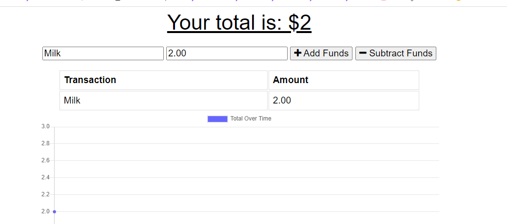

# 18_PWA_Budget_Tracker

## License

## Description

This app utilized caching and fetch methods to run the app when offline. If not connected to a network, the application is still fully fuctional using DB indexing to store and persist site data.

## Usage

Navigate to the applications tab in the developer console. Put the site in offline mode. You can save and track budget information all from within the browser.

## Link

Deployed Application: https://pwa-budget-tracker001.herokuapp.com/

## Images

## Questions

[github.com/sethglenn](https://github.com/sethglenn)

Contact me at my github profile above for any inquiries you may have.
